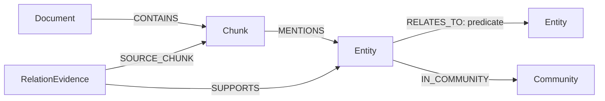
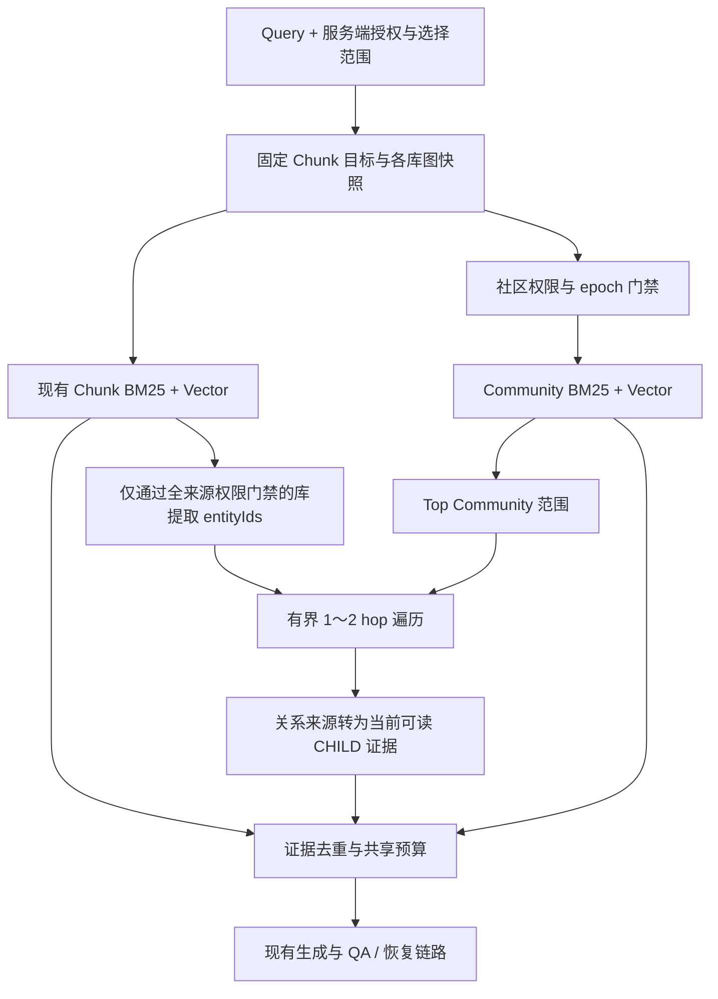

## Context

本设计依据用户提供的 Leiden / Community / GraphRAG 参考文字及评审决定编写。用户已确认首版采用 ArcadeDB 内置无权 Leiden，并授权生成 `tasks.md`；本次完成实施任务拆分，不开始实现。

当前项目为 Java 21 / Spring Boot 3.5.6，使用 MySQL、Elasticsearch、Redis/common SDK，以及 LangChain4j 与 LangGraph4j。实际知识问答主路径为 `LangGraphAgenticWorkflow → QaChildRetrievalService`，先用 CHILD 证据生成并接受 QA 检查，再按既有恢复流程补充 PARENT、改写或扩大召回；`HybridRetrievalOrchestrator` 和 `es_search` 契约也需保持兼容，不能只改旧入口。

`ChunkDocument` 已记录 `kbId/resourceType/resourceId/revisionId/lifecycleVersion/parserVersion/chunkerVersion/indexVersion`，`kwiki-chunks` 已有独立物理版本管理。授权细到单页，文档可以 PRIVATE、指定成员或共享给库外用户；`kbId` 本身不是读权限。图、摘要、调试轨迹和引用必须继承该边界。

已核对官方资料：

- [ArcadeDB 社区算法](https://docs.arcadedb.com/arcadedb/reference/graph-algorithms/community-detection)：当前文档公开 `algo.leiden(relTypes, maxIterations, resolution)`，返回 `nodeId/community`，没有公开 `weightProperty`、实体类型过滤或知识库过滤参数。
- [ArcadeDB HTTP API](https://docs.arcadedb.com/arcadedb/reference/http-api/http)：提供数据库管理、查询、命令及事务接口，适合 Java 后端以适配器接入独立服务。
- [ArcadeDB 索引](https://docs.arcadedb.com/arcadedb/reference/sql/sql-indexes)与[性能诊断](https://docs.arcadedb.com/arcadedb/how-to/operations/performance-tuning)：可用复合属性索引，查询计划需用 EXPLAIN 验证。

以上是接口核对，不代表已验证某个部署版本。实现前必须锁定 ArcadeDB server 版本并做能力契约验证；本草案不假设 `MATCH/WHERE` 能把全局算法自动限制为输入子图。

## Goals / Non-Goals

**Goals:**

- 建立有原文来源的实体关系图，补足 Chunk 间的关系信息。
- 离线完成 Leiden、成员持久化、社区摘要和 embedding，线上只做召回与有界图查询。
- 社区作为搜索范围提示，种子实体作为起点；避免全图扫描和整社区灌入上下文。
- 版本隔离、文档权限、生命周期、原文引用与故障降级有可验收的行为。
- 复用现有发布、索引、QA、模型调用、分布式锁和管理认证机制。

**Non-Goals:**

- 首版不做跨知识库实体合并、在线 Leiden、层级/重叠社区、图谱编辑器或独立图可视化工作台。
- 首版不做基于全部社区报告的 global map-reduce 问答；无原文证据的社区摘要不能独立形成答案。
- 首版不要求加权 Leiden，也不把“同名实体”或“共同出现”直接解释为确定的语义关系。
- 不迁移既有 Chunk 搜索到 ArcadeDB，不替换 ES 索引版本控制，不改变现有 QA 恢复顺序。

## Decisions

### 1. 存储与服务职责

| 组件 | 职责 | 权威边界 |
| --- | --- | --- |
| MySQL | 页面/附件、修订、授权、生命周期；图任务、来源清单、发布指针与审计 | 原文和当前权限；哪份图快照已发布 |
| ArcadeDB | Document、Chunk、Entity、关系证据、Community、成员结构 | 可重建的图投影 |
| Elasticsearch | Chunk 内容和冗余 entityIds；新增 Community 摘要 BM25/vector 索引 | 可重建的召回与种子定位投影 |
| Java 后台任务 | 抽取、建图、Leiden 调度、摘要、验证与发布 | 作业协调、限额和幂等 |
| Java 在线检索 | 版本固定、授权、双路召回、图扩展、证据融合 | 请求范围与预算执行 |

新增领域端口建议为 `EntityRelationExtractionPort`、`KnowledgeGraphStore`、`CommunityDetectionPort`、`CommunitySummaryPort`、`CommunitySearchPort` 和 `GraphSnapshotRegistry`；名称是模块边界建议，不是现在需要创建的类。ArcadeDB HTTP/JSON 细节、RID、SQL/Cypher 仅位于基础设施适配器。

ArcadeDB 由用户单独部署，本项目负责连接配置、健康/能力探测、客户端、受控 schema 初始化和任务调度，不生成或启动 ArcadeDB 部署。在线只读身份和建图/临时库管理身份分离；命令固定模板并参数化，数据库名由服务端生成。模型、浏览器和用户均不能提交任意图查询。

配置契约使用 `kwiki.graph.enabled` 和 `kwiki.external.arcadedb.*`，覆盖 endpoint、database、query/build 两组 username/password、connectTimeout、queryTimeout、buildTimeout、连接并发、TLS 校验和临时库前缀。环境变量使用 `KWIKI_ARCADEDB_*`，密码仅从环境/密钥配置读取，不通过后台返回。默认连接超时 3s，在线查询上限 1.5s（同时受 run deadline 限制）；算法构建调用独立上限 15min，普通批写上限 30s。后台展示连接状态、脱敏 endpoint、服务版本及能力错误。建库权限不足时构建失败，不能改在包含全部业务顶点的正式库运行 Leiden。

替代方案：嵌入式 ArcadeDB 会把存储生命周期绑到应用实例，不适合当前多实例与运维边界；另起 Python 服务首版收益不足。

### 2. 图模型与来源身份



图中 `Document` 统一代表已发布 PAGE 或可索引 ATTACHMENT；不另存一份完整原文。`Chunk` 对齐现有 CHILD 标识，保存定位与父块引用，正文仍按既有 ES/原文加载器获取。`RelationEvidence` 是关系来源记录，指向 relationId、两端 entityId 和来源 Chunk；图示中的 SUPPORTS 仅表达来源联系，不用于聚类。

所有快照内记录携带 `kbId + graphVersion`；快照一旦 SEALED 不再改写。

| 对象 | 主要字段与约束 |
| --- | --- |
| Document | resourceType、resourceId、revisionId（附件允许空）、lifecycleVersion、contentHash |
| Chunk | sourceChunkId、chunkKey、parentChunkKey、indexVersion、parserVersion、chunkerVersion、资源身份、字符/页码定位 |
| Entity | entityId、canonicalName、entityType、受来源约束的 aliases、communityId |
| RELATES_TO | relationId、predicate、方向、confidence、supportCount；仅语义事实连接实体 |
| RelationEvidence | evidenceId、relationId、sourceChunkId、原文位置、抽取版本；支持端点归一化追溯 |
| Community | communityId、memberCount、summaryStatus；摘要正文由 ES 保存 |
| IN_COMMUNITY | 同一快照内 Entity 到 Community 的成员边 |

`entityId` 由知识库内的实体注册表分配，跨快照复用；实体的物理唯一键为 `(kbId, graphVersion, entityId)`。实体解析按“规范名称 + 类型 + 经验证别名 + 上下文消歧”进行。同名但有歧义时保留不同 ID；不按名称字符串强制合并，也不让 LLM 自由改写已有 ID。合并决策带 resolverVersion，发生变更时产生新快照。

`sourceChunkId` 是以下元组的稳定编码/哈希：`indexVersion + parserVersion + chunkerVersion + resourceType + resourceId + revisionId + lifecycleVersion + chunkKey + contentHash`。不能只使用 chunkKey，因为不同分块流水线可能复用序号。

#### ES CHILD 冗余实体映射

在 CHILD 文档中冗余抽取结果的 `entityIds`，BM25/vector 命中时一并返回；在线直接去重取得种子，不再逐个 Chunk 访问 ArcadeDB 查 MENTIONS。ArcadeDB 中仍保留 MENTIONS，用于离线建图、来源核验和修复。图扩展仍需要读取真实关系，冗余字段优化的是种子定位这一次数据库往返。

新增字段建议如下（示例仅展示 CHILD 的新增部分）：

```json
{
  "sourceChunkId": "source_chunk_101",
  "entityIds": ["e_redisson", "e_watchdog", "e_rlock"],
  "entityLinkingVersion": "extract-v1_prompt-v1_resolver-v1",
  "entityLinkingStatus": "READY"
}
```

- `entityIds` 为去重、稳定排序的 keyword 多值字段；只保存该 Chunk 有来源支持的实体 ID，不复制关系、社区成员或全库实体描述。PARENT 不聚合子块 entityIds，以免丢失实体的精确来源。
- `entityLinkingVersion` 固定 extractor/prompt/resolver 的整体代际，属于 Chunk 索引构建配置，也由 GraphSnapshot 记录。相同 sourceChunkId 和该版本复用同一持久化抽取结果；需要重做消歧或改变映射结果时升级此版本。
- `entityLinkingStatus` 区分 PENDING、READY、FAILED；READY 且空数组表示成功抽取但没有实体，字段缺失表示旧索引尚不具备此能力，两者不能混同。
- 不在 Chunk 上冗余 `communityId/graphVersion`：实体身份可跨 Leiden 快照复用，而社区编号会变。单纯重跑 Leiden 不改写全部 Chunk；请求使用当前固定快照判断实体成员。
- 当前 mapping 为 `dynamic: strict`。字段及实体映射代际通过既有 Chunk 索引版本流程创建支持它们的新物理索引，不把新字段直接写入旧 mapping。实体映射代际改变时也创建新物理索引，即使正文分块未变，保证旧索引与旧图快照仍可配对。
- `ChunkHit → ChildEvidence`、BM25/vector 适配器的字段投影和融合结果必须完整传递实体元数据及来源/生命周期身份；同一来源的重复分支命中不得合并不同代际的 entityIds。实体 ID 仅为服务端检索元数据，不自动进入用户响应或模型提示词。

同一有向三元组 `(kbId, sourceEntityId, predicate, targetEntityId)` 聚合为一条逻辑关系，多个来源分别存储。`supportCount` 按不同 sourceChunkId 去重，重复任务不增加支持数；在线可见支持数只统计当前请求可读且仍有效的来源。不把全库聚合描述或隐藏别名原样交给局部授权用户。

语义统一存为 `RELATES_TO` 类型，`predicate` 使用受控枚举，例如 `USES / DEPENDS_ON / PART_OF / IMPLEMENTS / BASED_ON / RELATED_TO`。LLM 未知关系类型不得动态创建 schema；不能识别的结构输出进入可诊断失败或明确的兜底类型，原文断言仍须存在。

### 3. 抽取与内容生命周期

从已成功产生的 CHILD 规范内容抽取，可在相同 parser/chunker 和内容身份下复用结果；输入包含必要的父标题/局部上下文，但每个输出必须指出实际支持它的 Chunk 与原文位置。引用来自父上下文时，必须关联其对应的真实来源片段，不能假称由当前 CHILD 支持。

模型输出用 JSON Schema 校验，验证实体、端点、predicate、confidence、引文/位置属于输入。无依据关系不落图；低质量抽取可重试并有硬上限。现有图片描述可作为有标记的派生来源，不能被升级为图中确定的新事实。

内容事件与 graph extraction job 采用持久化投递：以现有内容 change-event/outbox 为来源建立独立消费者及目标任务；Chunk 索引成功是抽取执行条件，但不能只靠进程内回调，否则在 ES 成功后崩溃会漏任务。图任务失败不回滚页面发布、不改变已成功的 Chunk 任务状态。

幂等键包含来源身份、extractorVersion、promptVersion、resolverVersion。模型输出缓存及抽取状态可先持久化到 MySQL，快照构建按来源清单引用；ArcadeDB 批次具有唯一业务键，可安全重放。锁沿用 `DistributedLockFactory`，数据库租约/fencing 防止失去锁的旧 worker 覆盖接管结果。

ES 实体映射异步回填：Chunk 初次写入即可检索，实体状态为 PENDING；抽取结果持久化后，以独立可重试的目标任务把 entityIds/version/READY 一起写入相应 Chunk **物理索引**。回填必须条件匹配 sourceChunkId、revision/lifecycle、索引流水线和预期 entityLinkingVersion，且只更新实体字段；禁止 upsert 创建已被删除的 Chunk，也不重写正文或向量。冲突时重新检查来源，过期任务作废，不盲目覆盖。

ArcadeDB 投影写入和 ES 回填分别记录完成状态；任一存储成功后进程退出，均可从已持久化的同一抽取结果幂等恢复另一目标，无需再次调用模型。普通 Chunk 重建/全量覆盖必须复用匹配的实体映射，或重置为 PENDING 并持久化安排回填，不能永久丢失字段。快照 READY 门禁包含其完整来源清单的 ES entityIds 回填覆盖与一致性校验；普通 Chunk 搜索不等待这项图门禁。

发布更新、删除、归档、恢复和权限变更更新持久化内容/安全 epoch，并入队图刷新。删除一个来源仅撤销该来源贡献，不连带删除仍有其他有效来源的关系。历史快照可保留，但在线每条证据必须再次验证当前 revision、lifecycle 和权限，失效来源立即不可用，不等下一次 Leiden。恢复后使用新 lifecycle 身份，旧任务不得复活已归档内容。

### 4. 原生 Leiden 只运行于独立实体投影

首版已确认使用 `ARCADEDB_NATIVE_UNWEIGHTED`。“投影”是供算法计算的精简图副本：只保留 entityId 与实体间连接，不复制正文、Chunk 或文档层级；“独立临时”指在用户部署的**同一个 ArcadeDB 服务**内建立临时数据库，例如 `kwiki_leiden_<runId>`，不需要另部署 ArcadeDB 实例。任务结束清理该库，正式图仍在配置的业务数据库中。每个构建运行的投影仅包含一个知识库、一个冻结来源清单的 Entity 和 `CONNECTED` 边：

1. 从确定的抽取结果集合生成 Entity–Entity 投影，保留孤立实体。
2. 将允许的语义 predicate 投影为无向连接；方向仍保留在正式事实图。
3. 删除自环，同一无序实体对不因重复来源、双向关系或多种 predicate 重复添加 CONNECTED。阈值只用于决定连接是否存在，不冒充加权 Leiden。
4. 调用以下文档接口，并将临时 RID 映射回 entityId。

```cypher
CALL algo.leiden('CONNECTED', 10, 1.0)
YIELD nodeId, community
RETURN nodeId, community
```

5. 验证每个投影实体恰有一个成员结果，孤立实体有独立社区；空图得到合法空快照。
6. 写正式图快照及成员索引。成功或失败后按 run 所有权清理临时库；清理失败可重试，不清理其他运行的库。

该接口未公开子图过滤，所以首版以物理隔离保证输入范围，不使用“调用后 WHERE kbId”冒充隔离。临时库每次只含一个构建输入，主图数据库中即使有多个知识库、版本、Document/Chunk/Community，也不会进入算法。

默认 `maxIterations=10`、`resolution=1.0`，构建清单记录参数、ArcadeDB 版本、投影 hash 与算法版本。不承诺重新运行的数字标签或划分完全一致；重试在已有完整结果时复用该结果，不覆盖已经发布的快照。

`confidence/supportCount` 首版用于过滤、代表证据选择及在线排序，不宣称参与原生 Leiden 权重优化。不得静默切换为 Louvain。

#### 外部加权 Leiden 的含义及备选权重规则

外部 worker 是独立于 ArcadeDB 引擎和在线请求的离线计算进程，例如安装 Python `igraph + leidenalg` 的批处理容器。Java 作业导出冻结的 entityId 列表及 `(sourceId,targetId,weight)` 边，worker 在内存中计算并返回 `entityId → communityId`，Java 校验结果后写回正式图。它不存业务原文、不代替 ArcadeDB，也不是另一个 LLM。[leidenalg 官方接口](https://leidenalg.readthedocs.io/en/stable/reference.html)支持显式 weights 与随机 seed；若选该方案，投影是导出的计算输入，无需为运行内置算法创建临时 ArcadeDB 数据库。

权重由应用依据证据计算，算法只消费权重。备选初始公式如下，属于待质量评估的业务启发式，不是库默认公式或已证明的最优参数：

```text
d = 支持该有向关系的独立当前来源文档数，至少 1
p = 明确语义关系 1.0；泛化 RELATED_TO 0.5
relationWeight = min(5.0, p × (1 + ln(d)))
undirectedPairWeight = max(该无序实体对各有向关系的 relationWeight)
```

同一资源的重复 Chunk、旧修订和重放仅算一次；重复内容按文档内容 hash 去重，导入页面与其来源附件的相同证据只计一个来源组。先验证关系有原文依据，再计数；单纯同段共现不产生语义边。1 篇文档支持的 USES 权重为 1，4 篇独立文档约为 2.39；泛化关联在相同支持数下为其一半。取无序实体对最大值避免双向边、多 predicate 重复叠加。原始 LLM 自报 confidence 不当作概率乘入公式；若将来使用，必须先用标注样本校准并升级 weightPolicyVersion。

外部模式还需固定库版本、质量函数（建议先评估 RBConfiguration）、resolution、seed、weightPolicyVersion、内存/超时和输入 hash；它们改变时创建新快照。此模式仅作为备选解释，首版未引入 Python 运行依赖。

### 5. 图版本是不可变快照，不覆盖在线 Entity

本期令 `communityVersion = graphVersion`，只保留一套版本编号，避免含义重叠。社区完整身份为 `(kbId, graphVersion, communityId)`。示例中的 `42:17` 仍需带知识库边界；裸 `17` 不出现在跨请求稳定引用中。

Leiden 新结果写入新 Entity 物理记录、Community 和 IN_COMMUNITY；旧快照的 Entity.communityId 不动。仅在同一 Entity 上覆盖 `communityVersion` 无法让旧读请求继续工作，因此不采用该写法。

正式库索引至少包括：

| 类型 | 索引键 | 用途 |
| --- | --- | --- |
| Entity | `(kbId, graphVersion, entityId)` UNIQUE | 直接定位种子 |
| Entity | `(kbId, graphVersion, communityId)` NOTUNIQUE | 社区成员范围定位 |
| Community | `(kbId, graphVersion, communityId)` UNIQUE | 精确校验社区 |
| Chunk | `(kbId, graphVersion, sourceChunkId)` UNIQUE | 来源核验、离线映射及修复；在线种子由 ES entityIds 提供 |
| RelationEvidence | `(kbId, graphVersion, relationId, evidenceId)` UNIQUE | 去重及证据验证 |

索引存在不等于遍历天然有界。在线先用种子唯一索引，再在遍历每一步限制 kbId/version/community、边型、可见证据和访问数量；禁止先加载整个社区再在 Java 中截断。实现阶段用 EXPLAIN 及高扇出数据验证访问路径。

### 6. 来源清单、构建状态与发布一致性

MySQL 逻辑元数据：批次 `GraphBuildBatch`、按库子任务 `GraphBuildRun`、`CommunityIndexVersion`、`GraphSourceManifest`（分页持久化来源身份）、`GraphSnapshot`、`GraphPublication`、`GraphExtractionJob` 及命令审计。具体表/列由实现阶段按现有 Flyway 约定落地，此处不预分配迁移编号。

来源清单从权威数据库的一致性读取得资源集合和不可变修订身份，绑定目标 Chunk 物理索引及 parser/chunker 配置。记录 content/security epoch 与事件水位；水位只能在前序事件完整消费后推进，不能用最大已见事件号假装处理完毕。抽取缺失项补齐到清单要求的精确身份；并发变化通过 epoch 差异使候选失效并重新捕获，禁止混合两个时点数据后标为完整。

```text
QUEUED → EXTRACTING → PROJECTING → CLUSTERING
       → SUMMARIZING → INDEXING → VALIDATING → READY
       → PUBLISHED → RETIRED
```

任一阶段可进入 FAILED/CANCELLED；来源 epoch 改变的候选进入 STALE，重新捕获来源时创建新批次，并分配新图快照及 COMMUNITY 版本；原任务的版本标记保持不变。同一来源的可重试阶段使用持久化检查点和同一 run，算法整体调用不能伪装支持中途续算。失败社区摘要/embedding 不能静默丢弃后发布完整快照；空图是单独合法情况。

每个 GraphSnapshot 清单包含：kbId、graphVersion、sourceManifestId/hash、chunkIndexVersion/sourceChunkPhysicalIndex/流水线、communityIndexVersion/communityPhysicalIndex、entityLinkingVersion、graphSchemaVersion、ArcadeDB 目标库、communityMappingVersion、摘要模型/prompt/embedding 身份、来源 epoch、节点/关系/社区数量、检查结果与校验和。两类 ES 版本、图版本和 mapping schema 版本分别表达不同含义，不可复用同一个 version 字段。

发布步骤：

1. 图写入完成、成员完整；清单内每个 CHILD 的 entityIds 均已 READY（允许有效空数组），与持久化抽取结果及图 MENTIONS 一致；ES 实体字段、社区文档和向量完成且 refresh 后可查；检验唯一键、来源、数量、摘要 schema、mapping/维度和有界样例。
2. 冻结快照为 READY。发布前核对当前来源/安全 epoch 与构建值；发生变化则候选转 STALE 并重新构建，不能宣称当前。
3. 在持有按库发布锁的 MySQL 事务内，再核对 epoch（与内容/权限更新共用该 epoch 行锁），用 compare-and-set 把 `GraphPublication(kbId, chunkIndexVersion).activeSnapshotId` 改为该快照；这是唯一发布提交点。按 Chunk 版本区分发布配对，允许预建候选 Chunk 版本的图而不挤掉当前版本配套的图。
4. 每次查询开始一次性固定所需各库的发布清单，随后使用清单中的**社区物理索引名**和 graphVersion，不在中途重新读取活动版本。ES 别名可以用于运维展示，但不作为在线版本配对依据。
5. 发布后崩溃时从 MySQL 指针恢复；发布前失败只留下可清理的候选数据。外部存储在发布后故障则降级，不能偷偷拼接其他版本补齐。

这样避免“ES alias 更新成功、MySQL activeGraphVersion 更新失败”的混版窗口；没有宣称 ES 与 MySQL 存在跨库事务。多知识库查询固定的是一组清单，各库独立发布，不要求全局同时换代。

回滚切回仍完整且与当前 Chunk 流水线兼容的历史快照；逐条来源复核照常执行，epoch 不匹配时社区摘要保持禁用。保留至少当前和上一个版本，同时设置覆盖最大请求时长的退役宽限期；引用中的快照不可删除。清理先标 DELETING 使新 pin 失败，再确认无活动读取租约，按快照拥有的对象清单删除，失败可重试。

### 7. 社区摘要和独立 ES 索引

按度数与不同来源支持数选择代表实体、关系和 Chunk，稳定 ID 用作平局排序；首版不额外运行 PageRank。输入建议上限为 20 实体、30 关系、8 Chunk 和 12,000 字符，全部可调但有服务端硬限额。超大社区仍只取代表子集；孤立实体使用其实际来源生成简短主题描述。

摘要 schema 包括 `title/summary/keywords/coreConcepts/importantRelations/questionTypes/sourceRefs`。每条重要关系/摘要断言须绑定给定 sourceRefs，禁止新增实体 ID、关系或虚构引用；schema 或来源检查失败则重试/失败。LLM 的角色是概括证据，不是社区成员或事实的裁决者。

新增逻辑索引类型 COMMUNITY，与现有 CHUNK 在后台并列管理。社区物理索引命名为 `kwiki-communities-v{communityIndexVersion}-kb{kbId}`，命名由服务端控制；遵循项目现有连字符风格。`communityIndexVersion` 由服务端独立单调分配，每个构建批次一个新版本；全量批次的所有知识库子任务共用该版本号，分别生成独立物理索引。一次指定知识库构建也分配新社区版本，但只创建该库物理索引。图版本仍按知识库标识图快照，不等同社区 ES 版本。

这里的“两类索引”指 CHUNK 和 COMMUNITY 两个逻辑索引族，不代表 ES 永远只有两个物理索引。后台必须列出社区版本下每个知识库的物理索引、配对图快照与发布状态；只成功一部分知识库的批次不能显示为全局成功。已发布的物理索引不原地清空重建；同来源失败重试复用候选版本及幂等写，来源改变则另建新批次/版本。

```json
{
  "communityKey": "kb_123:42:17",
  "kbId": 123,
  "graphVersion": 42,
  "communityIndexVersion": 7,
  "communityId": 17,
  "sourceManifestId": "manifest_42",
  "sourceContentEpoch": 108,
  "sourceSecurityEpoch": 9,
  "sourceChunkIndexVersion": 3,
  "title": "Spring AOP 与事务管理",
  "summary": "基于所选原文证据生成的社区概述",
  "keywords": ["Spring AOP", "事务", "代理"],
  "representativeEntityIds": ["e_1001", "e_1023"],
  "sourceRefs": ["source_chunk_101"],
  "entityCount": 127,
  "summaryModel": "configured-model",
  "summaryPromptVersion": "v1",
  "embeddingModel": "configured-embedding-model",
  "embeddingDimensions": 1024,
  "vector": []
}
```

示例模型、维度和空 vector 仅示意字段；实际向量长度必须等于快照固定的 embeddingDimensions。title/summary/keywords 使用 BM25，vector 使用向量检索，精确身份字段为 keyword/整数，mapping 严格校验。社区 embedding 模型可以与 Chunk 相同；仅在 query、model、dimensions 均相同时共享请求内 query embedding。

两个社区召回分支按现有标准 RRF（k=60）融合。默认每分支 Top10，最终 Top3 社区是整个请求上限，不是每个知识库各 3 个；不同模型分别产生匹配的查询向量。Chunk 分数和社区分数不直接相加，二者分别承担原文证据和图定位职责。

### 8. 全来源建社区，部分授权用户走既有检索

社区由多篇文档的拓扑和内容派生。只确认“用户能读代表 Chunk”，甚至只给摘要加 kbId，都不能证明摘要没有泄露其他文档。

首版仅当请求同时满足以下条件，才允许查询该知识库的社区索引、使用其成员约束、摘要及代表实体：

- 用户当前能读取该库全部有效可索引来源及快照**整个来源清单**，而非仅属于知识库或能读部分摘要引用；新加入的不可见文档也使该库图增强关闭。
- 用户本次选择的查询范围也覆盖整个来源清单；有权限但只选了一页时，不能加入其他页主题。
- 构建 content/security epoch 与当前值相等，且该快照与本次固定的 Chunk 索引流水线兼容。

判断在社区 BM25/vector TopK **之前**进行。不满足的知识库不参与社区排名，也不返回社区标题、数量或隐藏来源派生的实体别名。完整来源检查可以用带 epoch 的集合覆盖证明加速，不能凭角色名假定覆盖。

按用户确认的规则，社区基于该知识库的全部有效来源离线构建，不按用户拆分社区。用户对该库存在不可见来源，或本次选择范围未覆盖完整来源时，该库**整条图增强路径关闭**：不查社区索引、不使用摘要、不做 seed-only 或其他图扩展，沿用现有 Chunk 混合检索及 QA/PARENT 恢复流程。entityIds 即使存在也不触发该库图查询。多库请求按库判断，通过门禁的库可以增强，未通过的库只贡献既有授权 Chunk 证据。

内容或权限发生任何变化使旧摘要 epoch 不匹配，立即停止使用旧摘要；新的全量来源覆盖证明成立时，仍有效的图事实可逐条核验使用，否则该库走既有流程。请求内 scope/content epoch 变化时，按既有出站守卫停止失效输出并要求重新检索，不能将权限错误当普通服务超时忽略。

权衡：部分授权用户保持原有检索体验，首版不维护按用户复制的图或摘要；这项行为已确认，不再保留“部分授权 seed-only 增强”方案。

### 9. 在线流程与有界扩展



1. 请求固定 `RetrievalSnapshotContext`：Chunk 物理索引及版本、各库匹配该 Chunk 版本的 GraphSnapshot、Community 物理索引及版本、授权版本和预算；先判定各库全来源可见性，不合格库不进入任何图增强步骤，后续阶段保持同一配置，具体资源仍检查当前性。
2. Chunk 与通过门禁的社区搜索并行。按实际主路径使用 `QaChildRetrievalService`，保持 BM25/vector 的前置权限过滤、RRF 与阶段 TopK；DIRECT 路径不启动图增强。
3. 直接从已授权且当前有效的 CHILD 命中读取 READY 的 entityIds；只接受 sourceChunkId 与实体映射代际匹配固定快照的结果，按 Chunk 排名稳定去重取种子。不再执行 Chunk → MENTIONS 查询，也不发起逐 Chunk 的图请求；把种子和支持它的 sourceChunkId 合并提交给后续有界图扩展，在该步骤批量验证实体存在于固定快照及其来源归属、成员范围。新增 Chunk 尚未进入快照时跳过该种子，不仅因同名 entityId 已存在就放行。优先选择落在命中社区内的种子；若没有交集，不修改社区成员来强行匹配。
4. 有社区无 Chunk 命中时，可从 Top 社区的少量代表实体启动扩展，但须先加载并验证其来源 Chunk。没有可用原文则不能用摘要直接回答。
5. 已通过全来源授权/选择范围门禁的库，有种子但社区零命中或社区服务故障时，才允许同预算 seed-only 扩展；权限/选择范围不完整的库不能使用该回退。没有种子/安全代表实体则跳过图。entityIds 缺失、PENDING/FAILED、有效空数组或版本不匹配时，不在线回查 MENTIONS、不临时调用模型抽实体；继续 Chunk 路径，或使用通过门禁且有原文支撑的社区代表实体路径。可修复的缺失交由后台幂等补齐。默认不跨命中社区扩展；已通过门禁的跨社区关系查询由 seed-only 回退补充，仍受范围和预算约束。
6. 使用逐层受限邻接查询，每层先执行知识库、版本、社区（适用时）、predicate 和有效证据约束。不提交无限制的可变长路径查询，也不先扫描全社区。
7. 返回实体和关系时同时携带 sourceRefs，回查对应 CHILD。图新增 CHILD 也受该阶段 finalTopK/字符预算，PARENT 补充仍由 QA 决定。
8. 在上下文入模、引用和 SSE 出站前复核权限/生命周期；图版本不存在或不兼容则该增强分支失败，继续可用的 Chunk 证据。

默认建议预算（待环境压测后调整配置）：

| 项目 | 默认上限 |
| --- | --- |
| 社区候选 | 各分支 10，融合后全请求 3 |
| 种子 | 全请求 8 |
| hop | 2，可配置为 1，首版硬上限 2 |
| 返回实体 / 关系 | 20 / 30 |
| 每节点检查邻边 / 全请求检查边 | 50 / 500 |
| 图新增 CHILD | 5，仍受既有 finalTopK 总额限制 |
| 社区与关系说明文本 | 合计 4,000 字符，计入当前阶段总上下文预算 |
| 在线增强总耗时 | 1,500 ms，且不超过 run 剩余 deadline |

“检查边”包括最后被过滤掉的邻边；达到读取上限就返回 truncated，不能持续翻页寻找可见边直到扫完整图。返回少于 TopK 是合法结果。底层必须具备有界邻接读取/取消机制，不能仅在客户端拿到全量后 LIMIT；契约/压测发现实现不满足时，该路径不得上线。

### 10. 证据、QA、引用与失败语义

图新增证据构成独立有序来源列表，通过 sourceChunkId 去重，保留 `retrievalSource=GRAPH`、路径、关系、snapshot 和 round。图列表按种子召回次序、较短 hop、当前可见来源支持数降序、稳定来源 ID 排序；原始 Chunk 融合列表的内部排名保留。将这两份列表以 RRF k=60 融合，重新应用当前阶段 finalTopK；不额外重复加入已融合的 BM25/vector 列表。当前 QA 主路径各轮重新排名，不累加前轮分数；同一轮回调重试不得重复加分，旧 es_search 的多轮契约保持原样。

摘要和关系描述是辅助材料，只有保留下来的原文 sourceRefs 才能支持最终断言。上下文裁剪移除某一引用的全部原文时，同时移除该引用及仅依赖它的图断言。引用继续走已有 PAGE/ATTACHMENT 修订与定位，不把 Entity/Community 当成新的可点击原文来源。

接入点是实际 `retrieveChildren` 阶段的确定性增强，之后保持已有“生成 → QA → 有界恢复”顺序。重写查询时可在余下 run 预算内重新定位社区/种子；所有轮次共享 run 的累计图访问量、耗时和上下文限制，不能每次 tool/回调重置额度。`es_search` 保持当前 ES 语义，不给 LLM 开放任意 Cypher 或可自选 kb/version 的图工具。

故障处理：

- ArcadeDB、社区索引、摘要、embedding 单支故障：记录明确 degradation，使用成功分支；HYBRID 向量失败可保留 BM25。
- 图不存在、未构建、版本不兼容或预算耗尽：跳过增强，保持原有 Chunk 检索；图禁用时不连接 ArcadeDB。
- Chunk 查询成功但零命中：图找到有效原文可以补充；只有社区摘要则按既有 no-evidence 恢复。
- Chunk 的所有检索分支均基础设施失败：维持既有 retrieval-failed 语义，不把图摘要当成成功检索绕过故障。
- 权限撤销：停止失权输出，不能通过降级继续暴露缓存图/摘要。

### 11. 运行与管理

新增配置分组 `kwiki.graph` 与 ArcadeDB 外部连接配置。`enabled=false` 为默认值；显式开启后验证 endpoint/database/credentials、schema 和算法能力，无 localhost/默认密码兜底。只读查询故障与写入/发布故障分开统计。

#### 调度与构建范围

每天 **02:00，Asia/Shanghai** 触发一个应用内全量图构建批次；调度是本项目后台功能，不是 Codex 自动化。配置为 `kwiki.graph.schedule.cron=0 0 2 * * *`、`zone=Asia/Shanghai`。默认不开启变化阈值触发，增量抽取与 entityIds 回填仍持续处理内容事件；社区全量重算由夜间或手动任务启动。

现有后台提供两种范围：`ALL`（提交时固定所有未归档且启用图构建的知识库集合）与 `KNOWLEDGE_BASE`（指定一个知识库 ID）。每库子任务均重算该库完整图/社区，复用来源与版本完全匹配的抽取结果；“全量”不意味着重建所有历史 Chunk 索引，也不意味着强制重跑所有 LLM 抽取。新入库但不在批次范围内的知识库由下次任务覆盖。目标 Chunk 索引未追平或实体 schema 不支持时，记录 WAITING_FOR_CHUNKS/UNSUPPORTED 并拒绝进入算法阶段，不能跳过缺失来源后标为成功。

每天的 `(scheduleId, Asia/Shanghai 日期)` 唯一键保证多实例只生成一个定时批次。短暂停机后可在当日恢复一次漏跑，不补跑所有历史日期；若有上次未完成批次则先恢复，重复调度标记 SKIPPED_ACTIVE 并显示关联批次。手动单库任务与全量批次的同库子任务共用锁，返回 BUSY/已有 run，不产生重复写。一个知识库失败不阻止其他子任务运行，批次以 PARTIAL_FAILED 报告完整结果，重试只恢复原版本对的失败项；来源变化需要新批次。

构建与发布分离：新版本仅在验证成功且 autoPublish 开关允许时自动发布，默认由管理员发布。自动发布也只能推进任务固定的 Chunk 版本下的图配对，不能擅自切换 Chunk 读别名。

#### 每个构建任务固定两个 ES 版本标记

提交时由服务端读取/校验 Chunk 目标：默认解析当前 CHUNK 读别名，也可由管理员选择已构建、支持实体 schema 且配置未脏的候选版本。随后为本批次分配全新的 COMMUNITY 版本，并持久化以下字段；运行中禁止重新解析别名替换目标：

| 字段 | 示例 | 语义 |
| --- | --- | --- |
| chunkIndexVersion | 3 | 来源 Chunk 和 entityIds 回填的目标版本 |
| chunkPhysicalIndex | kwiki-chunks-v3 | 解析后的实际目标名，以注册记录为准 |
| communityIndexVersion | 7 | 本批次新建的社区索引版本 |
| communityPhysicalIndex | kwiki-communities-v7-kb123 | 每个知识库子任务的精确写目标 |
| graphVersion | 42 | 该知识库本次图快照，与两类 ES 版本分开 |

批次列表、子任务、回填/索引阶段、重试、校验、审计统一显示 **CHUNK v3 / COMMUNITY v7** 两个徽标；详情同时展示物理索引名、配置修订和 graphVersion。父批次只有一个版本对和知识库目标清单，不伪造跨库共用的单一 communityPhysicalIndex。纯 Chunk 管理任务不涉及 COMMUNITY 时显示“—（不涉及）”，不能把 Chunk v3 伪装为社区 v3。

索引版本注册表需要记录任务引用；构建期间禁止删除、原地重建、编辑目标 Chunk 版本，仍允许合法内容更新（由身份/epoch 校验检测）、查询别名切换及取消任务。别名切到 v4 不把运行中的 v3/v7 任务改成 v4/v7；重试仍绑定 v3/v7。新选定 Chunk 无兼容图时按既有规则降级。

#### 现有管理后台中的页面

基于现有 `admin-frontend/src/views/IndexManagementView.vue` 和 `/admin/` 认证/路由扩展，不创建独立管理应用：

- **索引管理**：增加 CHUNK / COMMUNITY 类型切换。CHUNK 保留现有创建、构建、补齐和热切换；COMMUNITY 展示版本、每库物理索引、匹配 Chunk 版本、图快照、文档/实体/社区数、mapping/model 配置、存储量、校验及发布状态，并链接到构建任务。
- **知识图谱任务**：提供“全部知识库 / 指定知识库”、Chunk 目标版本、构建动作和任务列表，双 ES 版本徽标始终可见；展示父子任务进度、来源水位、实体回填覆盖、模型成本、失败重试/取消、校验、发布/回滚。
- **调度与服务状态**：显示每日 02:00、Asia/Shanghai、下一次执行、漏跑/冲突状态、ArcadeDB 连接及服务版本、容量配置。敏感连接参数不通过页面回显。

管理 API 在 `/api/v1/admin/knowledge-graphs` 下提供批次/子任务及调度状态，ES 管理接口增加显式 indexKind 的社区版本视图。API 与页面均使用现有平台 `ROLE_ADMIN`、JWT、幂等命令和审计；长操作返回 batchId/runId。COMMUNITY 的“当前”由各库发布配对派生，不能把手动移动 ES alias 当成发布图快照，也不把社区索引接入原 Chunk parser 全量重建入口。

#### 首版容量与预算决定

下列数值是项目初始保护阈值，不是对未知硬件的性能保证；均服务端可配置并在管理后台展示。上线前用目标 ArcadeDB 版本做容量验收，不因低于数量阈值就绕过内存/磁盘健康检查。

| 项目 | 默认限制 | 处理 |
| --- | --- | --- |
| 每知识库、每快照 Entity | 50,000 | 20,000 起预警；超限阻止该库构建 |
| 每知识库、每快照语义关系 | 250,000 | 100,000 起预警；按去重有向三元组计数 |
| 每知识库关系来源记录 | 1,000,000 | 与逻辑边分开计数；超限阻止构建 |
| 每知识库社区摘要数 | 5,000 | 控制孤点导致的模型成本；超限阻止发布并报告 |
| 全局运行中的知识库构建 / 临时投影库 | 1 / 1 | 全量批次排队逐库处理 |
| LLM 抽取/摘要共享并发与限速 | 2 并发、1 请求/秒 | 不含现有在线回答配额，低优先级执行 |
| 每项模型调用总尝试次数 | 3 | 超限明确失败，可管理员重试 |
| 图批写 / ES bulk | 各最多 500 条且 5 MiB | 任一条件先达到即提交一批 |
| 原生 Leiden 单次执行 | 15 分钟 | 超时标记失败；确认远端已结束后才释放算法槽位 |

Entity/关系上限约束单库计算规模，来源记录和摘要数分别约束溯源存储与模型成本。孤立点和低质量社区不会被静默删除以通过限额。全量批次持续到各库终态，超过 6 小时给后台耗时预警，不能承诺未知规模下在某个时刻必定完成。

按库最多一个活动构建、单独发布锁；临时库或图规模超限返回 CAPACITY_EXCEEDED，不截断全量输入后伪称完整。取消/HTTP 超时不等于远端算法已停止；需探测远端任务/会话状态或使用目标版本支持的取消机制，不能边计算边删临时库或立刻启动新算法。远端状态不明时保留槽位、标记 NEEDS_ATTENTION。清理和接管仍通过租约、fencing 和资源所有权保证。

轨迹至少记录社区搜索、ES entityIds 种子提取、graph expansion、source validation 的耗时、允许披露的数量、截断与降级原因；后台记录实体映射回填覆盖率、积压和失败数。正文、隐私实体名、凭据不进普通日志；面向用户的 trace 不能泄露被拒绝社区信息。

## Risks / Trade-offs

- **[原生 Leiden 的版本差异、算法实现及规模能力未实测]** → 锁定版本，先验证输入隔离、孤点、双簇桥接、输出字段与内存上限；失败阻断图功能启用，既有检索可用。
- **[无权 Leiden 忽略关系强弱]** → 明确记录 UNWEIGHTED，先评估任务集质量；需要权重时另行引入外部 Leiden，不能偷偷用重复边模拟权重。
- **[LLM 抽取/消歧产生错误事实]** → 来源、schema、受控类型、歧义保留、版本化 prompt，以及关系质量人工抽样；最终答案必须有原文支持。
- **[全来源权限门禁使社区覆盖受限]** → 按已确认规则，对不满足全来源权限/选择范围的知识库关闭图增强，保持原有 Chunk/QA 流程。
- **[内容持续变化导致候选快照难发布、旧摘要常失效]** → 合并触发、低峰构建、抽取缓存与失效指标；首版选择正确性优先，后续再细化摘要依赖 epoch。
- **[完整快照、临时数据库和每库 ES 索引增加容量]** → 并发/规模预检、退役与清理、实际知识库数量验收；大规模多库部署可能需要共享物理索引代际方案。
- **[高扇出节点使 2 hop 仍很昂贵]** → 限制实际读取边数、时间与响应量，验证底层邻接 API 有界性；超限返回部分增强而不是阻塞 Chunk 回答。
- **[Chunk 索引版本切换使 seed 映射失配]** → 固定物理版本并校验 manifest，不兼容时降级；为候选 Chunk 版本提前构建配套快照，不阻断原有索引切换能力。
- **[ES entityIds 回填延迟、覆盖丢失或修订竞态]** → 独立持久化目标任务、来源条件更新、覆盖后重新入队、快照发布覆盖校验；不回查 MENTIONS 兜底，不以旧 entityIds 配新正文。
- **[跨存储部分成功]** → READY 前完成校验，MySQL 单指针发布，重试幂等、可恢复清理；外部存储故障不读取混版数据。

## Migration Plan

1. 按已生成的 tasks 实施；接入时锁定 ArcadeDB 版本，并在图功能上线前完成隔离/算法/索引/邻接预算契约验证。
2. MySQL 复用 `src/main/resources/db/migration/V<number>__<description>.sql` 和 `scripts/validate-migrations.sh`；实际创建前重新枚举版本，追加元数据迁移，不改旧迁移。ArcadeDB 使用独立可重入 schema 管理与 schemaVersion，不能把图 DDL 交给 MySQL Flyway 执行。
3. 先部署默认关闭的适配器、事件消费者和作业控制；默认测试不要求真实 ArcadeDB，外部契约环境使用专用库。
4. 通过现有版本流程创建支持 entityIds 的 Chunk 物理索引，为试点知识库回填来源/抽取结果及 CHILD 实体字段，创建配对的离线图快照、社区索引，检查覆盖、质量、权限、容量和失败恢复；旧 Chunk 索引继续兼容无图运行。
5. 影子运行图召回并记录耗时/证据增益，比较 Spring 自调用事务、Redisson 续期等关系问题及无关系问题；不因增加图分支就假定答案更好。
6. 发布快照并按知识库灰度开启，管理端可回滚/关闭增强；关闭后现有 Chunk/QA 路径继续工作。

回滚应用增强逻辑无需删除新增存储；保留快照供排查，按退役清理规则删除。任何涉及真实服务的部署、迁移与数据清理均属于后续实施范围，本次未执行。

## Open Questions

已确认：ArcadeDB 由用户独立部署，本项目完成配置和接入；社区使用全来源，部分授权用户走既有检索流程；管理功能集成现有后台并显示两类 ES 索引；每天 Asia/Shanghai 02:00 调度，支持全量/指定知识库手动构建，每个任务固定两个 ES 版本标记。容量上限采用本设计第 11 节决定。

算法选择已确认：首版使用 ArcadeDB 内置无权 Leiden，同服务临时库隔离实体投影。第 4 节的外部加权 worker 和权重规则仅保留为后续参考，不纳入本次任务与依赖。当前没有待确认的架构选择。

实施时仍需填写真实部署的 ArcadeDB 固定版本、endpoint、凭据和可用资源/模型配额，并验证上述初始容量阈值。它们作为任务中的环境接入及上线验收条件，不阻碍任务拆分；`tasks.md` 已生成，所有实现项尚未执行。
