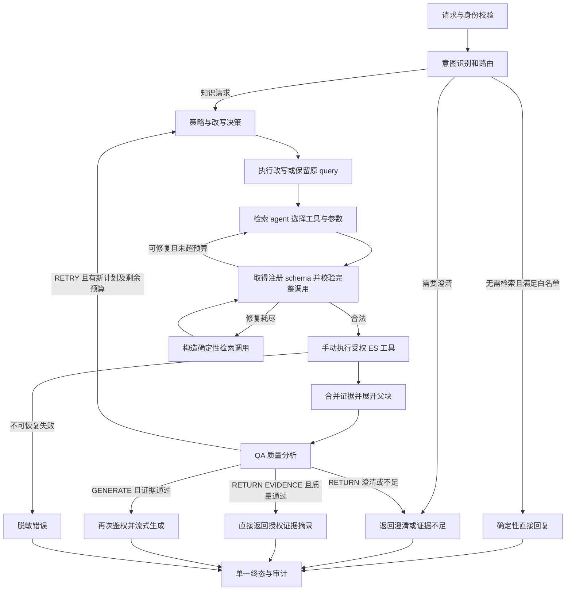

## Context

### 已检查的现状

kwiki 使用 Java 21、Spring Boot 3.5.6、Reactor SSE、Elasticsearch Java Client，尚未引入 LangChain4j / LangGraph4j。

| 位置 | 当前行为 | 本次处理 |
| --- | --- | --- |
| `infrastructure/ai/KwikiAiClientConfiguration` | 两个独立 WebClient；沿用 Spring Observation 传播 trace | 仅替换聊天客户端，保留 embedding 配置隔离 |
| `RouterLlmAdapter` | 自拼 chat/completions 请求和响应 JSON | 低层 ChatModel + 现有领域路由校验 |
| `StreamingAnswerLlmAdapter` | 自解析 SSE；`[DONE]` 映射为 null，存在 Reactor 不接受 null 的风险 | 由模型 SDK 解析协议，应用桥接冷 Flux |
| `RewriteLlmPort` | 只有接口；三个 rewriter 使用 Optional 注入，缺少真实适配器 | 补齐模型适配，保留失败回退 |
| `AgenticAnswerService` | 单次串行检索；不按 `needsRetrieval` 分支；提前 subscribe；未传聊天历史 | 改为请求级图执行入口，补齐路径与生命周期 |
| `HybridRetrievalOrchestrator` | 第一条子查询向量被全部子查询复用 | 每条查询独立向量，缓存限定在当前请求 |
| `QwenEmbeddingClient` | text-embedding-v4、默认 1024 维、分批、429/5xx 重试、结果数量/维度检查 | 本次保留；不把既有实现当作已完成供应商兼容性证明 |
| `frontend/src/features/wiki/sse.ts` | 固定七类事件 | 增量识别工具、QA、重试，兼容既有字段 |
| `ChatStreamEvent.toWire` / `ChatController.stream` | 前者已拼接 event/data 文本，后者再次放进 ServerSentEvent.data，存在双重封装问题 | 只让 HTTP 框架编码一次 SSE，使用 controller 级原始响应测试验证 |

这些结论来自源码阅读，不代表已执行当前工作区的运行测试。当前工作区有大量进行中的未提交改动；本次仅新增独立 OpenSpec change。

### k-Rag 的参考范围

参考 `/Users/kk/code/k-Rag` 中的 `AgenticRagWorkflowConfig`、`AgenticRagState`、`RouterNode`、`RetrieverNode`、`QueryRewriteNode`、`ManualToolCallingExecutor`、`AuthorizedToolExecutor` 和 `pom.xml`。该项目使用 LangChain4j 1.4.0 / LangGraph4j 1.8.20；其图具有检索后重写回环，检索质量判断主要嵌在 retriever/rewrite 节点内。

借鉴显式节点、状态传递、进度事件和授权执行上下文。kwiki 改为独立 QA 节点、正式 JSON Schema 校验、统一预算和纯 ES 工具；不搬入 Neo4j、Cypher、HyDE、多套并行 agent 框架、注解自动执行工具或缺失身份时的无权限检索分支。模型输出普通 JSON 与原生 tool calling 是两种传输方式，手动执行并不意味着只能使用 prompt 模拟调用。

## Goals / Non-Goals

**Goals:**

- LangChain4j 仅承担聊天模型客户端、请求/响应 DTO、流式传输及 tool schema 的协议映射。
- 显式完成意图、改写、策略、模型选工具、手动执行、证据 QA、有限回环、生成或直接返回。
- 复用领域接口、ES 召回/融合、权限和引用定位，保证重检索不能扩大授权范围。
- 图可用脚本化假模型测试，所有外部工作有预算和取消信号，进度可观察。

**Non-Goals:**

- 本次不接入 LangChain4j AiServices、自动工具执行器、RAG pipeline、EmbeddingStore、ChatMemory 或预制 agent。
- 不更换 embedding 模型/维度，不重新分块或建立新索引，不引入知识图谱、reranker、网络搜索。
- 不引入可跨进程恢复的 checkpoint、长时 agent、会话管理产品改造或新的中间件。
- QA 是**生成前的证据质量分析**；本次不做“先把答案 token 发给用户，再撤回重生成”的答案评审循环。

## Decisions

### D1. LangChain4j 最小边界与流式确认

**框架能力已确认**：低层 `StreamingChatModel` 支持部分文本、完成和错误回调，文档提供取消 handle；应用可保留自己的 `Flux<String>`。其低层 `ChatModel` 返回 `ToolExecutionRequest`，调用方手动执行并组装结果消息。因此不需要为流式或 tool calling 引入 AiServices。[流式文档](https://docs.langchain4j.dev/tutorials/response-streaming/)、[低层工具 API](https://docs.langchain4j.dev/tutorials/tools/)。

允许的依赖边界：`infrastructure/ai` 内使用 SDK 类型，`rag` 的领域端口仍使用 kwiki DTO。保留 `RouterLlmPort`、`RewriteLlmPort`、`AnswerLlmPort`；新增 `RetrievalPlannerPort` 和 `QualityAnalyzerPort`。工具请求和 schema 的 SDK 映射放在基础设施层，领域执行器不接收 SDK 的 executor 对象。

建议兼容性验证起点为 LangChain4j core / open-ai **1.20.0**（官方文档当前列出的普通 Java 依赖）及 LangGraph4j core **1.8.20**（本地参考版本、1.8 LTS 线）。这不是已经验证的组合：实现任务先检查制品可解析、Java 21 / Boot 3.5.6 / Jackson 2 依赖收敛、API 和取消语义，再固定准确版本；无需跟随 1.9 beta。JSON Schema 库采用支持 Draft 2020-12、兼容项目 Jackson 的 networknt json-schema-validator 版本，固定前验证闭合对象与数组约束。依赖校验失败时更新此表，不无声扩大框架使用范围。[客户端依赖](https://docs.langchain4j.dev/integrations/embedding-models/open-ai/)、[LangGraph4j 版本线](https://github.com/langgraph4j/langgraph4j)。

显式创建同步与流式 Bean，复用 `KWIKI_ANSWER_LLM_BASE_URL/API_KEY/MODEL/TIMEOUT`，按 router/rewrite/planner/QA/answer 角色提供参数和超时覆盖，默认使用同一供应商。启动只做本地配置校验，不请求模型。

Reactor 桥接要求：订阅后才开始模型调用；有界事件缓冲；回调轻量化；取消标记在首个 handle 到达前也有效；获取 handle 后立即补发取消；有截止时间兜底。所选 HTTP transport 必须通过首 token 前/后的断连测试，不把忽略回调等同于 HTTP 请求已停止。若 SDK handle 无法满足首帧前的终止，使用其 HTTP SPI 包装可取消请求，不恢复手写 completion/SSE 协议。Spring Observation 不会因替换 WebClient 自动延续，显式接入 observation/tracing transport，并捕获请求 trace context 后跨线程恢复。[HTTP SPI](https://docs.langchain4j.dev/tutorials/customizable-http-client/)。

正常/流式/结构化调用都限制总耗时、并发数和输出；非流式供应商重试由应用统一计费，默认关闭 SDK 隐式重试；已经输出 token 后不重放模型调用。错误只携带稳定错误码，默认不记录 prompts、完整证据、原始模型响应或凭据。

### D2. RAG 和 embedding 接口评估

| 方案 | 收益和代价 | 决策 |
| --- | --- | --- |
| 将 RAG 换成 LangChain4j ContentRetriever / RetrievalAugmentor / EmbeddingStore | 可复用通用流水线，但 kwiki 的 CHILD TopK 前过滤、RRF、父块扩展、revision 引用和 scopeVersion 仍要自定义；增加映射及控制权分散 | 保留现有领域接口和检索实现，以图节点组合 |
| 用 `EmbeddingModel` 包装现有 `ChunkEmbeddingPort` | 将来多供应商可减少协议代码；仍须负责分批、结果 index 对齐、模型/维度校验、预算和观测 | 可行，但本次不实施 |
| 保留 Qwen embedding 适配器 | 迁移面最小，不触及现有索引和入库流水线；保留少量 HTTP 代码 | 本次采用 |

LangChain4j 提供 OpenAI-compatible embedding 客户端、base URL 和 dimensions 配置；这只能证明存在接入路径，不能证明 kwiki 实际 Qwen endpoint 在批处理、维度、结果索引和错误语义上完全兼容。[Embedding 文档](https://docs.langchain4j.dev/integrations/embedding-models/open-ai/)。后续若切换，仅替换 `ChunkEmbeddingPort` 的内部实现，先以相同模型/维度执行契约测试；改变模型或维度必须另立索引迁移 change。

### D3. LangGraph4j core 编排，控制流归应用

**用户已确认**：使用 LangGraph4j core 保持 Java 单进程。官方 LangGraph 的 Python/JavaScript 运行时需要额外服务及跨语言状态、鉴权、取消、观测协议；当前没有这种基础设施需求。LangGraph4j 是独立 Java 项目，此处不把二者混称。[官方 LangGraph](https://docs.langchain.com/oss/python/langgraph/overview)、[LangGraph4j](https://github.com/langgraph4j/langgraph4j)。

使用 `StateGraph`、条件边和编译图，不使用任何预制工具执行节点。图在启动时编译；每次请求使用独立状态与 `RunContext`。对外保留 `AgenticAnswerService` 为 facade，图执行通过应用 `AgenticWorkflowPort` 隔离，LangGraph4j 实现在 infrastructure 下。



所有节点均受 deadline/cancellation/步数守卫；任一阶段的不可恢复错误汇入错误终态，断连只记录取消，不向已断开的连接发终态。图中的确定性 fallback 每轮最多一次；自身校验失败直接 internal-error，不再回到 fallback。图形展示业务分支，硬性守卫在每条边统一执行。

`AgenticState` 保存 `originalQuery`、`normalizedQuery`、`routePlan`、`rewriteResult`、`retrievalStrategy`、`retrievalRound`、`toolMessages`、`candidateRefs`、`evidence`、`qualityDecision`、`attemptSignatures`、`outcome`；各节点返回不可变更新。证据按稳定 child/parent/revision key 合并；工具消息和步骤列表有界追加，其余按声明覆盖。服务、凭据、连接、sink、CurrentUser 不放入可序列化状态，放在仅服务端持有的 `RunContext`（requestId、授权快照、trace、deadline、预算计数、取消令牌）。禁止以模型输出覆盖上下文。

### D4. 路由、改写和策略

沿用 rule-first：确定性单意图命中不调用 router LLM；冲突、复合或未命中请求才调用。保留现有闭合路由字段和枚举；检索策略和响应模式属于下一阶段的独立 `RetrievalDecision`，不把 ES DSL 混进路由 schema。路由或策略输出无效时使用受权 KNOWLEDGE_QA + HYBRID。

`DIRECT_ANSWER` 只有问候、帮助等服务端白名单可直接给出模板回复；LLM 单独声明不需检索不能放行企业知识问答。其他知识请求仍检索，无证据不调用回答模型。

改写支持 NONE / CONVERSATIONAL / EXPANSION / DECOMPOSITION，每轮最多三条非空去重 query，始终保留原始问题。现有 HTTP 请求仅含 query，本次不伪造会话历史或读入其他用户/其他会话的消息；无可信历史时 CONVERSATIONAL 回退原 query，若缺少关键指代则返回澄清。有可信历史的内部调用继续使用最多六轮的原有约束；完整会话 API 属于后续 change。

策略为 BM25 / VECTOR / HYBRID：精确名称/标识偏 BM25，语义问题可 VECTOR，默认及覆盖不足优先 HYBRID。agent 可在当前允许集合内选择工具和策略；不能改变索引、权限、分块类型、DSL 或硬预算。重试可以基于 QA 的缺失信息改写 query、切换策略或增加**预算以内**的 topK；不得重复相同规范化 queries + strategy + topK + scopeVersion 的尝试。

### D5. 自有 schema 与手动工具执行

比较三种方式：纯手写 tool-call HTTP 协议重复维护模型兼容性；`@Tool`/AiServices 自动执行不满足用户要求；**自有工具契约 + LangChain4j 低层传输**同时保留控制权并复用协议，因此采用第三种。

首期仅注册一个足够完整的 ES 工具 `es_search`，参数含策略，避免三个工具重复定义相同授权和预算逻辑；后续可按相同契约增加只读工具。父块查找是检索领域的受控内部步骤，不额外暴露任意 chunkId 查询工具。

`ToolDefinition(name, version, description, inputSchema, outputSchema)` 为单一事实源，资源建议放在 `src/main/resources/agentic/tools/es-search-v1.schema.json`。`ToolRegistry.get(name)` 允许应用读取原始 schema。输入示例（硬上界，运行时可配置更小的上限）：

```json
{
  "$schema": "https://json-schema.org/draft/2020-12/schema",
  "type": "object",
  "additionalProperties": false,
  "required": ["queries", "strategy", "topK"],
  "properties": {
    "queries": {
      "type": "array", "minItems": 1, "maxItems": 3, "uniqueItems": true,
      "items": {"type": "string", "minLength": 1, "maxLength": 1000}
    },
    "strategy": {"type": "string", "enum": ["BM25", "VECTOR", "HYBRID"]},
    "topK": {"type": "integer", "minimum": 1, "maximum": 200}
  }
}
```

`topK` 明确定义为每条 query 每个分支的 CHILD TopK；默认 50。融合 child 上限 40、distinct parent 上限 8、context 24000 字符仍由服务器配置控制，不是模型参数。

执行顺序：

1. planner 只收到本节点允许的工具规格。转换器从 canonical schema 构造 SDK `ToolSpecification`；如供应商不接受部分 JSON Schema 关键字，只投影可支持字段，**应用端完整校验不可削弱**，并测试语义映射。
2. 默认以非流式 ChatModel 取得完整 `ToolExecutionRequest`，转换为 `ToolCall(callId, name, rawArguments, modelTurnId)`；原生支持缺失或不兼容时，仅在明确配置的 JSON-envelope 模式下接受 `{toolCalls:[{id,name,arguments}]}`，继续走同一执行链，不能把自然语言回复当成工具结果。
3. 用本次发送的 catalog/version 查出 schema，验证工具名白名单、完整 JSON、大小/深度、禁止重复 JSON 键、required/type/enum/range/additionalProperties；随后语义校验 query 去空白、normalize 去重、topK 和轮次预算，整批不同 queries 合计不得超过每轮三条。校验完成才解码领域参数。未知工具、空 ID 或同一批内重复调用 ID 拒绝。
4. 全批调用先校验；通过后再按顺序执行，首期不开模型工具级并行（工具内部 ES 双分支仍并行）。校验失败不执行该批任何工具，给模型一次携带 callId 和字段错误码的纠正机会；耗尽则构造一次 server fallback 的 HYBRID 调用并走相同校验器。
5. `ManualToolDispatcher` 取得服务端 AuthorizationScope / 当前 scopeVersion / deadline，显式 `registry.require(name).handler().execute(context, validatedArgs)`；模型参数不接受 userId、kbIds、scope、DSL 等字段，提交即拒绝而非静默删除。调用前后都检查版本，TopK 前注入相同 scope filter。
6. 保存每个 callId 对应的 `ToolResult(status, evidenceRefs, degradations, errorCode, stats)`，校验结果 schema 后交给图。若后续模型需要工具交互记录，应用构造 assistant tool-call message 与逐 callId 对应的 tool-result messages，再请求下一模型步骤；成功、失败与超时都闭合调用记录。出站证据每次重新检查权限。

同一 run 内相同 callId + 相同参数只复用已完成结果，参数不一致视为协议错误；不同 ID 但等价查询的重复尝试由图拒绝。跨请求不共享去重缓存。完整 tool call 同时从完成响应和回调出现时，只执行一次；不对流式 arguments 碎片做执行。如果启动配置的 native 模型不支持工具，兼容性检查报告明确失败；不自动把普通聊天输出升级成调用。

### D6. 检索和独立 QA

复用 BM25RecallAdapter、VectorRecallAdapter、ConcurrentRecallService、StandardRrfFusion、ParentEvidenceResolver。BM25 不调用 embedding；VECTOR/HYBRID 对每个规范化 query 获取对应向量，当前请求按 query+model+dimensions 缓存成功结果。HYBRID 中 embedding 失败仅降级该 query 的向量分支；VECTOR 失败返回可识别错误，由图在剩余预算内选择 BM25/HYBRID，不能伪报 vector 成功。

各分支在 ES TopK 前过滤 CHILD 与权限；成功的排名列表使用标准 `Σ 1/(60+rank)`。跨轮保存新的排名来源和证据 provenance；相同 query/branch/配置签名的列表不得重复累加 RRF 贡献。重新截断 child/parent/context 上限；父块缺失、revision 失效或授权失效的证据不可继续累积。所有分支失败是检索错误，成功但零命中才是“无证据”。

QA 对**当前汇总后的受权证据**做判定，不把 BM25/vector/RRF 分数当作答案正确概率。先做确定性检查：空结果、权限/版本、重复证据、父块有效性、文本预算；通过后由 `QualityAnalyzerPort` 结合原始问题、子问题和证据引用判断相关性、子问题覆盖、矛盾与缺口。证据内容属于资料，不允许其指令改变 schema 或工具权限。

QA 闭合输出：`action: GENERATE|RETRY|RETURN`、`sufficient: boolean`、`supportedEvidenceIds: string[]`、`missingAspects: string[]`、`reasonCode`、`suggestedQueries: string[]`、`returnKind: NONE|CLARIFICATION|INSUFFICIENT|EVIDENCE`；必要字段全部声明，数组/字符串有界。语义校验要求引用存在于当前 evidence，GENERATE 必须 sufficient=true 且引用非空、returnKind=NONE；EVIDENCE 仅用于用户明确要求原文/资料且证据满足请求，不是对普通问答的默认替代。输出中的任意建议仍需经下一轮计划和 schema 校验，不能作为图节点名执行。

| 条件 | 应用决定 |
| --- | --- |
| 证据足够，问题可回答 | 再次鉴权 → 以最终证据流式生成 → 校验引用集合 → 返回引用 |
| 证据不足，有新 query/策略且预算允许 | 保留有效证据与 missingAspects → 下一轮 |
| 首轮零命中但存在新的检索方向 | 确定性 QA 标记不足，允许预算内改写/切换策略后重检索，不调用答案模型 |
| 无证据且无新方向、重复计划、后续轮无新增证据且无覆盖提升，或检索轮次耗尽 | 返回明确证据不足，绝不因“重试耗尽”自动放行生成 |
| 关键指代/条件缺失 | 返回简短澄清（模板或已验证的有限字段），结束当前 run |
| 用户要求原文且 QA 通过 | 直接格式化授权摘录和真实引用，不调用答案 LLM |
| QA 超时/非法输出 | 不视为通过；预算内尝试一次新的保守检索，否则返回 qa-unavailable/insufficient |
| 任意阶段 scope 变化 | authorization-changed，停止模型和工具调用，不返回旧证据 |

QA 判断的是证据可用性，不能证明流式答案每句话都正确。生成 prompt 显式绑定 parent ID，最终 citations 仅含实际使用且合法的引用；模型给出未知引用视为 answer-validation-failed，结束为 error，UI 将已收到文本标记不完整，不伪造映射。

### D7. 预算、终态与流式事件

建议默认预算：总检索轮次 3（含首次）、每轮最多 3 个工具调用、总工具执行 9 次、每轮最多一次 schema 纠正、全 run 模型请求最多 16 次、图节点执行最多 64 次、总 deadline 180s；全部允许配置更小的上限。沿用 childTopK=50、fusedChild=40、parents=8、subqueries=3、contextChars=24000、branchDeadline=5s。启动校验正数及交叉约束；路由默认 10s，其他非流式节点默认 15s，回答默认 120s，每次实际 timeout 均取节点上限与 run 剩余时间较小者。所有供应商重试/纠正均消耗模型预算，任何节点不得重置总计时。

检索轮次只在一次检索执行阶段开始时增加，schema 纠正不创建新检索轮次；工具调用尝试仍单独计数。从第二轮起，相对上一轮没有新 evidence key 且子问题覆盖不增加即视为无进展；首轮零命中允许一次有新方向的恢复尝试。禁止靠提高模型输出分数重置预算。图步数兜底超过阈值为 execution-limit 错误；检索/调用预算耗尽时，已有**通过 QA 的**证据且仍有生成所需模型额度和时间才可生成，否则返回证据不足；总 deadline 超时为 timeout 错误。

保持 `/api/v1/chat/stream` 请求 `{query}`。HTTP wire 使用 `event: <type>` 和 `data: {"seq":1,"requestId":"...","type":"...",...业务字段}`，业务字段扁平展开；`sequence` 和 `payload` 是内部 DTO 概念，不能替换 wire 的 `seq` 或引入嵌套 payload。修复现有 toWire 与 ServerSentEvent 的双重编码，让 ServerSentEvent.data 只接收 JSON 数据。新增 `tool`、`quality`、`retry` 事件，使用 node、round、status、toolName、callId、reasonCode、count、elapsed 等有限元数据；不发原始 tool arguments、完整质量推理或内部模型思考。route/rewrite/retrieve 可按轮次重复，seq 在一个 run 内始终单调递增，保留字段不可被业务数据覆盖。

`AgenticRun` 统一拥有图执行、模型/ES future、SSE sink 和最终化守卫，整个 Flux 延迟到订阅才开始，不在 service 方法内脱离生命周期提前 subscribe。阻塞图/ES/JDBC 工作使用有界 worker 或受信号量限制的虚拟线程，不能阻塞 I/O 回调；每个活跃外部调用注册取消函数。

成功路径：进度 → token（可零个）→ citations（无引用时为空数组）→ 一个 done。直接模板/摘录使用相同 token/citations/done 结构；无证据/澄清的 done 同时保留 message/noEvidence 并增加 outcome。错误路径只有一个 error 终态，无 done。终态后丢弃迟到回调；取消不再发事件；缓冲溢出取消上游并在连接可写时发 backpressure-overflow error。

引用发出前再次确认 scope；取消后取消图、planner、QA、embedding/ES、answer 并清理缓冲。原子终态守卫只触发一次审计，审计复用现有 request_trace JSON 与 chat tables，显式传递 requestId/traceId，不依赖异步线程碰巧存在的 MDC。记录 outcome、预算耗用、节点摘要和 tool schema version，不持久化完整图快照；持久化失败不覆盖已定终态，仅增加错误指标。无数据库结构变更。

## Risks / Trade-offs

- [SDK 版本及实际供应商工具/取消语义不一致] → 先做本地 MockWebServer 契约与实际 endpoint 的显式外部验证；框架文档确认与供应商实测分开记录。
- [首帧前 SDK 未提供取消 handle] → 验证 HTTP SPI/transport 可取消性；首帧前取消和 deadline 是迁移验收项，不以“停止 UI 更新”替代。
- [QA 增加延迟且可能误判] → 空证据先用规则过滤；限制模型请求和轮数；用覆盖缺口驱动重试，以离线标注样例衡量充分/不足判断，不比较不同搜索算法原始分数。
- [工具 schema 与供应商投影不一致] → canonical schema 是唯一执行依据，映射测试覆盖每个字段；供应商约束不是服务器验证的替代品。
- [中途撤权或证据过期] → 每个检索和证据出站边界检查；已发出的内容不能撤回，只能中止后续 token/引用。
- [新增进度事件打乱前端] → 增量扩展 parser/reducer，测试多轮事件与迟到事件；未知非终态事件应被忽略。
- [其他 OpenSpec change 同时演进] → apply 前重新读取工作区和未归档规格；归档阶段按能力边界去重，不覆盖其他任务成果。

## Migration Plan

1. 用户 review 本文 D1/D2/D3 的边界；实现期先生成兼容性报告与锁定依赖版本，验证本地协议测试。没有实际供应商结果时明确标为“待外部验收”。
2. 用 LangChain4j 替换聊天适配，保留领域端口并增加 rewrite/planner/QA 适配；通过 trace、超时、取消和错误契约。
3. 加入工具目录与手动分发；再接入检索策略与逐 query embedding；独立验证权限和 RRF 回归。
4. 将图接入 facade，完善 QA、预算和生命周期，最后更新前端事件。用假模型覆盖整图，无需联网运行默认测试。
5. 默认验证 `./mvnw verify` 与前端类型/测试/build；实际服务验收仅在配置齐全的 external-it 路径执行，使用脱敏固定问题，记录供应商、模型、版本和结果。
6. 通过后切换应用版本；本次没有 schema/index migration，可回滚前一部署制品和对应配置。避免长期同时维护两套主编排；旧版回滚会暂时失去新增 QA 闭环。

## Open Questions

### 供用户检查的具体选择

1. **客户端边界**：采用 ChatModel + StreamingChatModel + 消息/ToolSpecification DTO；同步规划与 QA 也使用同一个低层客户端，框架不拥有工具执行。流式能力已获官方文档确认，实际供应商仍待验证。
2. **编排实现（已确认）**：用户已选择“LangGraph4j core，保持 Java 单体”，本提案按此实施路径设计。
3. **RAG / embedding**：本次保留现有领域接口与 Qwen embedding；仅重构聊天协议、图编排和检索策略衔接。

客户端及 RAG/embedding 检查点来自用户“需要你确认，我 check”的要求，不是额外技能审批流程。本次提案和全部验收规格完整生成；编排选择已获用户确认，其余评估结论供用户检查。

### 实施时验证，不需要预先猜测

- 实际 `KWIKI_ANSWER_LLM_*` endpoint/model 的 native tools、结构化输出和取消表现；凭据不写入提案。
- 建议依赖版本的可解析性、Jackson 兼容、schema 投影、trace 传播与 transport 取消；以兼容性任务结果固定最终版本。
- QA 提示词在 kwiki 样例集中的充分性/缺口误判率和端到端延迟；不能仅凭“流程跑通”宣称质量提升。
